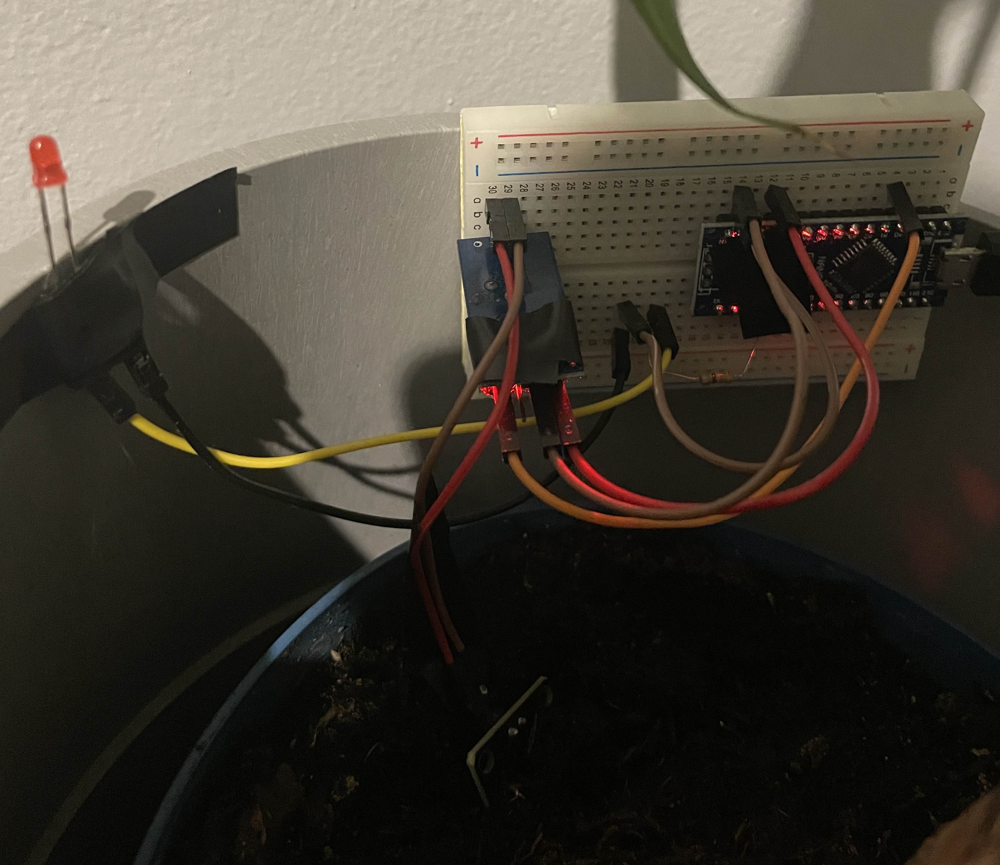

# About
This is a simple project using an Arduino board to notify my with an LED when my palm plant needs to be watered coz i can't keep track lmao.

# Components
- Arduino (I used nano)
- Soil moisture sensor ([aliexpress](https://www.aliexpress.com/item/1005006627469100.html?spm=a2g0o.productlist.main.25.55c2p0Obp0ObeO&algo_pvid=a0a563a9-b90f-4919-9042-c1637fd8e10a&algo_exp_id=a0a563a9-b90f-4919-9042-c1637fd8e10a-12&pdp_npi=4%40dis%21CZK%2147.08%2128.23%21%21%2114.06%218.43%21%40210384b217297053385355317ed2e8%2112000037942547777%21sea%21CZ%216151117802%21X&curPageLogUid=ZXI8ure9YCjt&utparam-url=scene%3Asearch%7Cquery_from%3A))
- LED (probably a 330ohm resistor as well)

### Connections
- Connect LED to D2
- Connect moisture sensor to Analog 0 (A0)

# Image for reference
</img>

# Usage
1. Connect everything as it's supposed to be connected
2. Upload the code to your arduino
3. Stick the moisture sensor into your DRY soil
4. Open Serial monitor of your arduino
5. Check the dry value
6. Water your plant
7. Check the value of your wet soil
8. Choose a number a little higher than the dry soil number
9. Modify the constant 'DRY_SOIL_VALUE' to your number
10. Upload it and enjoy this project and never forget to water your plant ;)